# TradeScope - AI-Powered Crypto Analytics Platform

**TradeScope** is a comprehensive cryptocurrency analysis platform that combines real-time market data with AI-driven news sentiment analysis. It empowers traders with actionable insights by aggregating news from major financial sources, analyzing market sentiment using advanced AI models, and visualizing data on interactive, real-time charts.

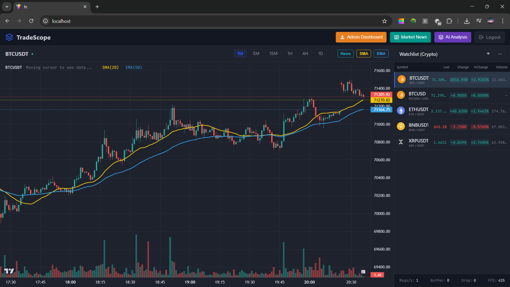

---

## Key Features

### 1. Real-time Market Data & Charts
- **Interactive Charts**: Powered by `lightweight-charts`, offering a TradingView-like experience.
- **Multi-Timeframe**: Support for 1m, 5m, 15m, 1h, 4h, 1d timeframes.
- **Multiple Pairs**: Track major cryptocurrencies like BTCUSDT, ETHUSDT, BNBUSDT, etc.
- **Real-time Updates**: Live price updates via WebSocket for zero-latency capability.
- **Technical Indicators**: Built-in SMA, EMA overlays.
- **News Markers**: Visual markers on the chart timeline indicating when major news occurred.

### 2. Intelligent News Aggregation
- **Multi-source Crawler**: Automatically ingests news from CNBC, Coindesk, Cointelegraph, and more.
- **Sentiment Analysis**: AI models evaluate news sentiment (Positive/Negative/Neutral) to gauge market mood.
- **Rich Metadata**: Displays author, source, timestamp, and a direct link to the original article.
- **Smart Filtering**: Filter news by specific coins or view "All Followed Symbols" at once.

### 3. AI Market Analysis
- **Trend Prediction**: Uses window-based news aggregation to predict market trends (UP/DOWN).
- **AI Explanation**: Integrated with **Ollama (Local LLM)** to generate natural language explanations for market movements in Vietnamese.
- **Causal Reasoning**: Connects specific breaking news events to price actions.

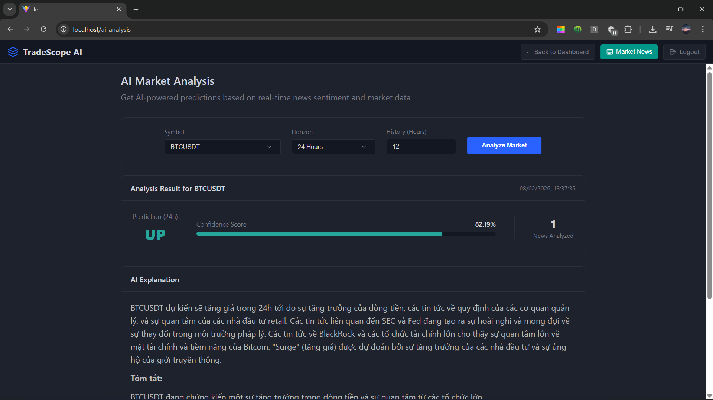

### 4. User Management & Security
- **Role-based Access Control (RBAC)**:
    - **Guest/User**: Basic charts and news.
    - **VIP**: Exclusive access to AI Analysis and advanced insights.
    - **Admin**: User management dashboard.
- **Admin Dashboard**: Manage users, grant/revoke VIP status instantly via toggle.
- **Secure Authentication**: JWT-based authentication with Access and Refresh tokens.

---

## System Architecture

TradeScope is built on a robust **Microservices Architecture**, ensuring scalability and maintainability.

| Service | Tech Stack | Description |
| :--- | :--- | :--- |
| **Frontend** | React, TypeScript, Vite | Modern, responsive SPA with dark/light mode. |
| **Auth Service** | Java, Spring Boot | User authentication, registration, and JWT management. |
| **Market Service** | Java, Spring Boot | Manages market data, symbols, and historical price APIs. |
| **Ingest Service** | Java, Spring Boot | News crawler and data ingestion engine. |
| **AI Service** | Python, FastAPI | Runs AI models for sentiment analysis and trend prediction (Ollama integration). |
| **WS Service** | Java, Spring Boot | WebSocket server for real-time price streaming. |
| **API Gateway** | Java, Spring Cloud Gateway | Unified entry point for all client requests. |
| **Database** | MySQL, MongoDB, Redis | Polyglot persistence for relational data, documents, and caching. |

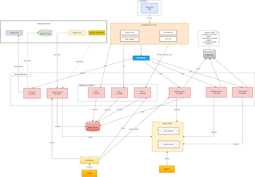

---

## Prerequisites

Before running the project, ensure you have the following installed:

- **Docker** & **Docker Compose** (Recommended method)
- **Node.js** (v18+) (For local frontend dev)
- **Java JDK 17+** & **Maven** (For local backend dev)
- **Python 3.9+** (For local AI service dev)
- **Ollama**: Installed and running locally for AI features.
    - Pull the model: `ollama pull gemma3:1b` (or update `OLLAMA_MODEL` in env).

---

## Installation & Setup

### 1. Clone the Repository
```bash
git clone https://github.com/vuden2605/KTPM-CQ2022-3.git
cd KTPM-CQ2022-3
```

### 2. Environment Configuration
The project is pre-configured with `docker-compose.yml`. You may need to adjust `.env` files if you have port conflicts.

### 3. Run with Docker Compose
Build and start all services:
```bash
docker-compose up -d --build
```

Access the application:
- **Frontend**: http://localhost:3000
- **API Gateway**: http://localhost:80
- **Eureka Discovery**: http://localhost:8761

### 4. Setup AI Model (Ollama)
Ensure Ollama is running on your host machine or configure it within the docker network.
By default, the AI Service connects to `http://host.docker.internal:11434`.

```bash
# On your host machine
ollama serve
ollama pull gemma3:1b
```

---

## Usage Guide

### User Access & VIP Upgrade
1.  **Login/Register** to access the platform.
2.  Upgrade to **VIP** via the convenient payment gateway to unlock AI features.

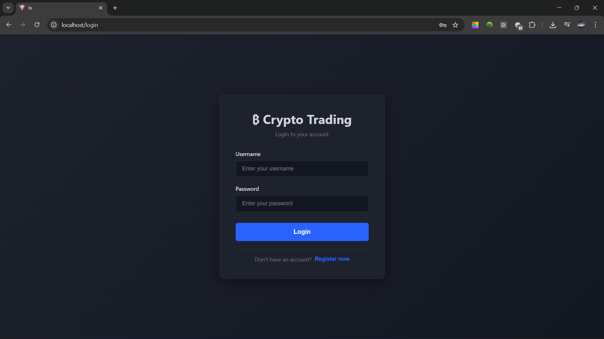

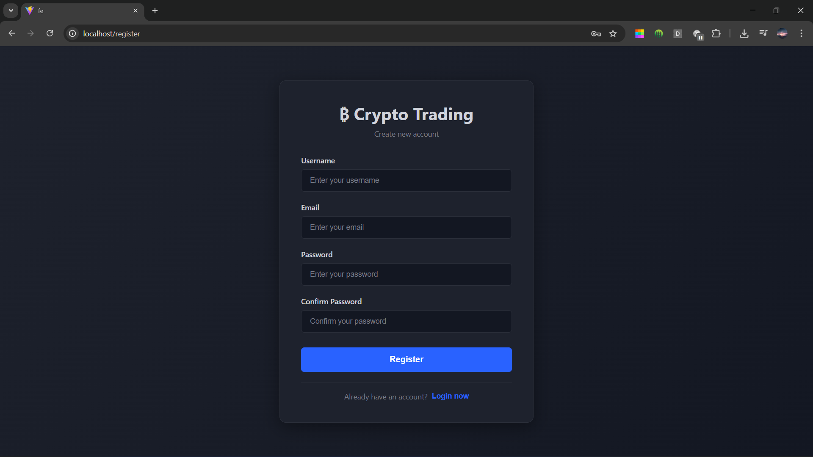

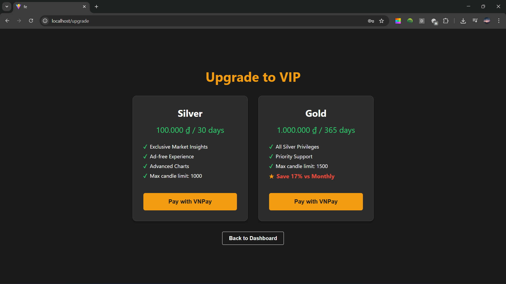

### Dashboard Analytics
1.  Select a coin from the **Watchlist** (right sidebar).
2.  View the **Candlestick Chart** and **News Feed** side-by-side.
3.  Toggle **"News"** button on the chart toolbar to show/hide news markers.


### Chart Interactions
1.  **Quick News Access**: Click the 📰 icon on the chart to see the **3 latest news headlines** instantly.
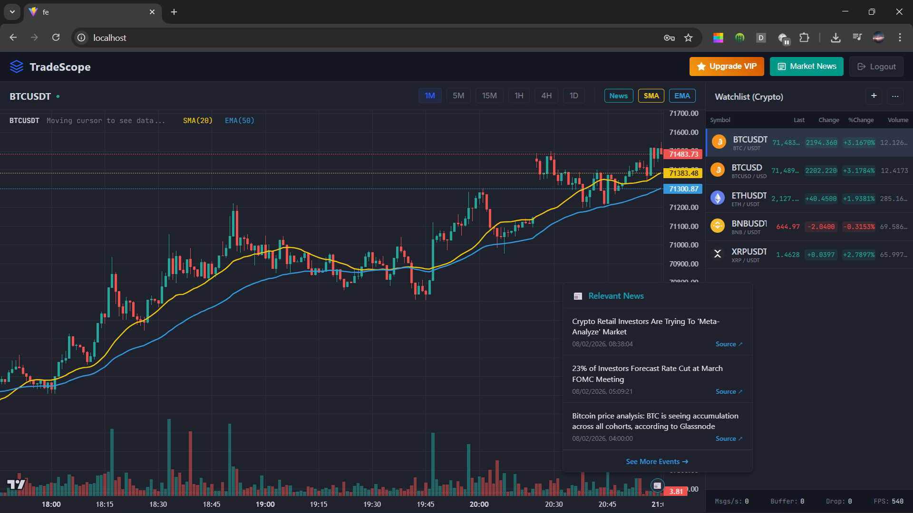

2.  **Contextual Insights**: Click on any **News Marker (Arrow)** on the chart to view specific news events that happened during that time interval.
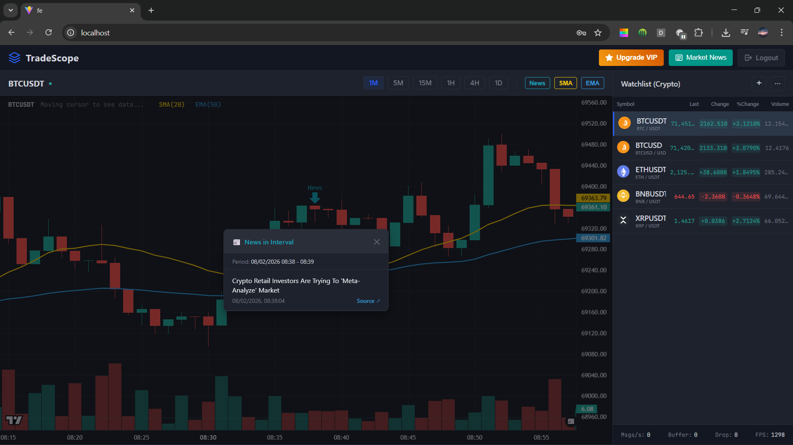

### Customizing Watchlist
1.  Click the **Edit** icon on the Watchlist.
2.  **Toggle** raw symbols to Show/Hide them from your main view.
3.  Save changes to personalize your dashboard.

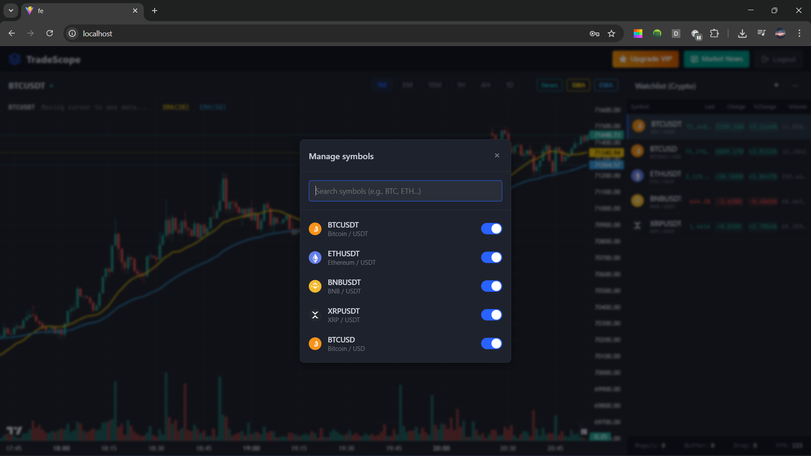

### News Reading & Market Updates
1.  Navigate to **News** page to view aggregated crypto news.
2.  **Filter** by specific coin (e.g., BTC, ETH) or view **"All Followed Symbols"**.
3.  Read details including **Sentiment Score**, **Author**, and **Source**.
4.  Click on a news item to read the full content or visit the original source.

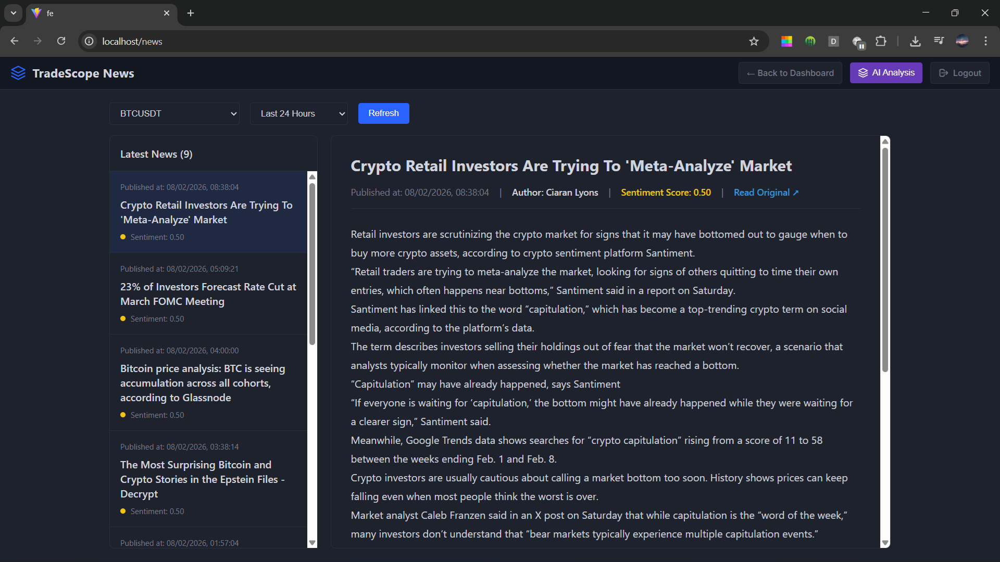

### Admin Portal
1.  Login with an Admin account.
2.  Navigate to **Admin Dashboard**.
3.  View list of users.
4.  Toggle the **VIP** switch to grant premium access.

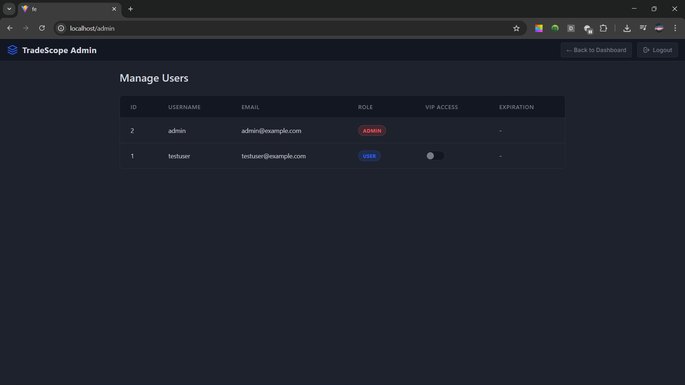

### AI Analysis (VIP Only)
1.  Navigate to **AI Analysis** page.
2.  Select a symbol and time horizon (e.g., 24h).
3.  Click **"Analyze"**.
4.  Read the **AI Prediction** regarding price direction and the detailed **Reasoning** generated by the LLM.


---

## Authors

| Student ID | Full Name | Github |
| :--- | :--- | :--- |
| **22120432** | Nông Quốc Việt | [Github Link](https://github.com/QuocViet1302) |
| **22120440** | Nguyễn Quang Vũ | [Github Link](https://github.com/vuden2605) |
| **22120442** | Nguyễn Văn Vũ | [Github Link](https://github.com/thanhan06) |
| **22120443** | Trương Lê Anh Vũ | [Github Link](https://github.com/tlavu2004) |

---

## Contribution

1.  Fork the repository.
2.  Create a feature branch (`git checkout -b feature/AmazingFeature`).
3.  Commit your changes (`git commit -m 'Add some AmazingFeature'`).
4.  Push to the branch (`git push origin feature/AmazingFeature`).
5.  Open a Pull Request.

---

## License

Distributed under the MIT License. See `LICENSE` for more information.
